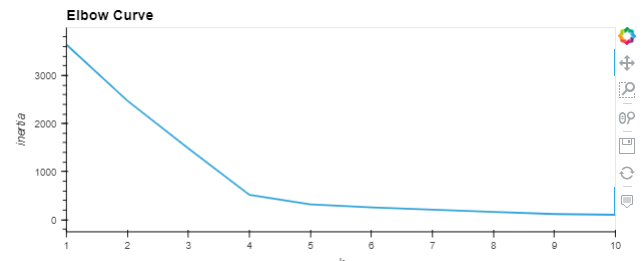
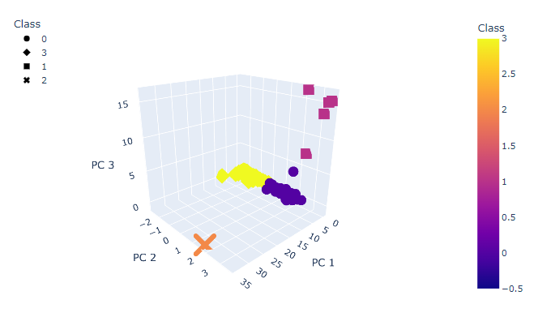
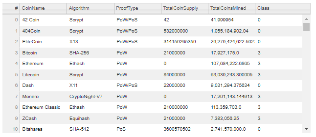
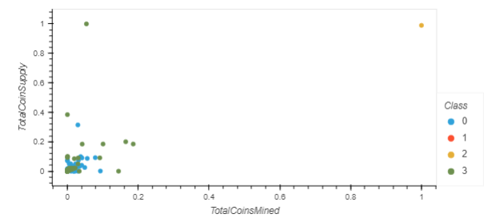

# Cryptocurrencies Analysis

## Project Overview
In this project, we assist Martha who is a Senior Manager for the Advisory Services Team at Accountability Accounting. Accountability Accounting is a prominent investment bank that is interested to offer a new cryptocurrency investment portfolio to its customers.

The company has asked us to create a report that includes what cryptocurrencies are on the trading market and how they could be grouped to create a classification system for this new investment.
 

## Data Source:
- [crypto_data.csv](https://github.com/maherabdallah/Cryptocurrencies/blob/main/data/crypto_data.csv)
-- The data provided was not ideal and needed to undergo processing to fit the machine learning models. An unsupervised machine learning model was used to cluster the data, as well as provide data visualizations on our findings.
 
# Results
## Clustering Crytocurrencies Using K-Means

- To determine the correct number of clusters to use in our machine learning model, we plotted an elbow curve
- From our elbow curve, we determined the best number of clusters is 4
 
 

## Visualizing Cryptocurrencies Results
### 3D-Scatter

- Using the PCA algorithm with three principal components, we observed four distinct clusters of cryptocurrencies in our 3D scatter plot model
 
 

### Table of Tradable Cryptocurrencies

 
 

### TotalCoinsMined vs TotalCoinSupply Scatter Plot 

- A 2D scatter plot was generated, with the x-axis of TotalCoinsMined and TotalCoinSupply on the y-axis
- Unfortunately, this scatter plot does not distinctly visualize all clusters appropriately

## Summary

From our findings using an unsupervised machine learning model, we concluded there are a total of 532 tradable cryptocurrencies. These tradable cryptocurrencies were all split between 4 clusters, which was made known using an elbow curve plot to identify the correct amount. The 3D scatter plot depicts each cluster using 3 principal components.